# 🎙️ AI Voice Assistant - Realtime Multilingual Conversational AI

[](https://opensource.org/licenses/MIT)
[](https://docs.docker.com/compose/)
[](https://www.python.org/)
[](CONTRIBUTING.md)

> **🚧 Work in Progress** - This is an ambitious open-source project building a production-ready, sub-second latency voice assistant with speculative prefetch capabilities. We're actively seeking contributors!

## 🌟 Overview

A sophisticated **realtime multilingual voice assistant** with enterprise-grade architecture, featuring:

- **⚡ Sub-second Response Times** (~300-900ms TTFA) via speculative prefetch
- **🌍 Multilingual Support** with code-switching (English ↔ Nepali and more)
- **🎯 Speculative Intelligence** - Predicts and prefetches responses before you finish speaking
- **🏗️ Microservices Architecture** - 9 specialized services with comprehensive monitoring
- **🔒 Privacy-First Design** - Consent-based recording with GDPR compliance
- **📱 Modern Web Interface** - Interactive demo with voice visualization

## 🎯 Key Features

### 🚀 Performance
- **Streaming ASR** with partial transcripts (50-150ms cadence)
- **Intent Recognition** on partial speech for speculative execution
- **Streaming TTS** with sentence-by-sentence playback
- **Barge-in Support** for natural conversation flow

### 🧠 Intelligence
- **RAG Integration** for document-based conversations
- **Tool Calling** (weather, search, calendar, etc.)
- **Context Awareness** with session management
- **Multilingual Code-Switching** detection and handling

### 🔧 Architecture
- **9 Microservices**: Gateway, Auth, Speech, Intent, Orchestrator, RAG, TTS, LLM, Analytics
- **Real-time Monitoring** with Prometheus, Grafana, Jaeger
- **Scalable Deployment** from single-node to Kubernetes
- **GPU Acceleration** for speech processing and TTS

## 🏗️ System Architecture

```mermaid
graph TB
    Client[🎤 Web Client] --> Gateway[🚪 API Gateway]
    Gateway --> Auth[🔐 Auth Service]
    Gateway --> Speech[🗣️ Speech Service]
    
    Speech --> Intent[🎯 Intent Service]
    Intent --> Orchestrator[🎼 Orchestrator]
    
    Orchestrator --> RAG[📚 RAG Service]
    Orchestrator --> LLM[🧠 LLM Service]
    Orchestrator --> TTS[🔊 TTS Service]
    
    Analytics[📊 Analytics] --> Prometheus[📈 Prometheus]
    Prometheus --> Grafana[📊 Grafana]
    
    Redis[(🔄 Redis)] --> Gateway
    Redis --> Auth
    Redis --> Speech
    
    PostgreSQL[(🗄️ PostgreSQL)] --> Auth
    PostgreSQL --> Analytics
```



### Service Responsibilities

| Service | Purpose | Key Features |
|---------|---------|--------------|
| **Gateway** | Entry point, WebSocket management | Auth, rate limiting, session management |
| **Speech** | Audio processing | Streaming ASR, VAD, language detection |
| **Intent** | Fast classification | Intent recognition, slot extraction, speculation |
| **Orchestrator** | Request coordination | Speculative execution, tool routing |
| **RAG** | Document retrieval | Vector search, query rewriting |
| **LLM** | Language understanding | Tool calling, multilingual responses |
| **TTS** | Speech synthesis | Streaming audio, voice cloning |
| **Analytics** | Metrics collection | Performance tracking, user insights |
| **Auth** | User management | JWT tokens, session handling |

## 🚀 Quick Start

### Prerequisites

- **Docker & Docker Compose** (20.10+)
- **Python 3.11+** for development
- **Node.js 18+** for frontend
- **8GB+ RAM** recommended
- **NVIDIA GPU** optional (for better performance)

### 1. Clone Repository

```bash
git clone https://github.com/your-username/AI-interaction.git
cd AI-interaction
```

### 2. Environment Setup

```bash
# Copy environment template
cp .env.example .env

# Edit configuration (add API keys if using external LLM providers)
nano .env
```

### 3. Start Services

```bash
# Start all services
docker-compose up -d

# Check service health
docker-compose ps

# View logs
docker-compose logs -f gateway
```

### 4. Access Demo

- **Web Interface**: http://localhost:8090
- **API Gateway**: http://localhost:8080
- **Grafana Dashboard**: http://localhost:3000 (admin/admin)
- **Prometheus**: http://localhost:9090

## 🎮 Usage Examples

### Web Interface
1. Open http://localhost:8090
2. Upload a document (PDF, DOC, TXT)
3. Enable voice interaction
4. Start speaking naturally!

### API Integration

```javascript
// WebSocket connection
const ws = new WebSocket('ws://localhost:8080/realtime');

// Send audio frame
ws.send(JSON.stringify({
  t: "audio_frame",
  session_id: "session_123",
  codec: "opus",
  payload: audioBytes
}));

// Receive responses
ws.onmessage = (event) => {
  const msg = JSON.parse(event.data);
  if (msg.t === 'asr_partial') {
    console.log('Transcript:', msg.text);
  }
};
```

## 🛠️ Development

### Local Development Setup

```bash
# Install development dependencies
make bootstrap

# Start development environment
make dev-up

# Run tests
make test

# Code quality checks
make lint
make security-scan
```

### Service Development

Each service is independently developable:

```bash
# Work on specific service
cd services/speech
python -m venv venv
source venv/bin/activate
pip install -r requirements.txt
python -m app.main
```

## 📊 Monitoring & Observability

### Metrics Dashboard
- **Grafana**: http://localhost:3000
- **Prometheus**: http://localhost:9090
- **Jaeger Tracing**: http://localhost:16686

### Key Metrics
- **TTFA (Time to First Audio)**: Target <900ms
- **Intent Accuracy**: Partial vs final transcript
- **Speculation Hit Rate**: Prefetch success rate
- **Service Health**: Uptime and response times

## 🤝 Contributing

**We need your help!** This project is actively seeking contributors in these areas:

### 🎯 High Priority Areas

- **🧠 ML/AI Engineers**: Improve intent recognition and speculation models
- **🎤 Audio Processing**: Enhance VAD, noise reduction, and ASR accuracy
- **🌐 Frontend Developers**: Polish the web interface and add mobile support
- **⚡ Performance Engineers**: Optimize latency and resource usage
- **🔒 Security Experts**: Strengthen privacy and security measures
- **📚 Documentation**: Improve guides, tutorials, and API docs

### 🛠️ Technical Contributions Needed

- [ ] **Speculation Model Training**: Improve next-turn prediction accuracy
- [ ] **Mobile App Development**: React Native or Flutter implementation
- [ ] **Edge Deployment**: Optimize for resource-constrained environments
- [ ] **Language Support**: Add more languages and improve code-switching
- [ ] **Testing Framework**: Comprehensive E2E and load testing
- [ ] **Kubernetes Manifests**: Production-ready K8s deployment

### 🎨 Non-Technical Contributions

- [ ] **UI/UX Design**: Improve user experience and accessibility
- [ ] **Documentation**: Write tutorials, guides, and examples
- [ ] **Community Building**: Help with Discord, forums, and events
- [ ] **Testing**: Manual testing across different devices and scenarios
- [ ] **Translation**: Localize interface and documentation

### Getting Started as a Contributor

1. **Contact me**: [samippokhrel5@gmail.com](mailto:samippokhrel5@gmail.com)
2. **Check issues**: Look for `good-first-issue` and `help-wanted` labels
3. **Read**: [CONTRIBUTING.md](CONTRIBUTING.md) for detailed guidelines
4. **Fork & PR**: Standard GitHub workflow

## 📋 System Requirements

### Minimum Requirements
- **CPU**: 4 cores, 2.5GHz+
- **RAM**: 8GB
- **Storage**: 20GB free space
- **Network**: Broadband internet

### Recommended (Production)
- **CPU**: 8+ cores, 3.0GHz+
- **RAM**: 16GB+
- **GPU**: NVIDIA RTX 3060+ or equivalent
- **Storage**: SSD with 50GB+ free space

## 🚀 Deployment Options

### Development
```bash
docker-compose up -d
```

### Production (Docker)
```bash
docker-compose -f docker-compose.prod.yml up -d
```

### Kubernetes
```bash
kubectl apply -f infra/kubernetes/
```

### Cloud Providers
- **AWS**: EKS with GPU node groups
- **GCP**: GKE with T4/V100 instances
- **Azure**: AKS with GPU-enabled nodes

## 🔧 Configuration

Key configuration options in `.env`:

```bash
# LLM Provider (openai, anthropic, local)
DEFAULT_PROVIDER=openai
OPENAI_API_KEY=your_key_here

# GPU Acceleration
GPU_ENABLED=true
CUDA_VISIBLE_DEVICES=0,1

# Performance Tuning
SPECULATION_THRESHOLD=0.75
MAX_CONCURRENT_SESSIONS=100
```

## 📈 Roadmap

### Phase 1 (Current) - Core Functionality ✅
- [x] Basic voice interaction pipeline
- [x] Microservices architecture
- [x] Web demo interface
- [x] Monitoring stack

### Phase 2 - Intelligence & Performance 🚧
- [ ] Speculation model training
- [ ] Advanced RAG capabilities
- [ ] Mobile app development
- [ ] Performance optimization

### Phase 3 - Enterprise Features 📋
- [ ] Multi-tenant architecture
- [ ] Advanced security features
- [ ] Compliance certifications
- [ ] Edge deployment support

## 🐛 Known Issues & Limitations

- **Intent Service**: Occasional "unhealthy" status (timing issue, functionality works)
- **GPU Memory**: High VRAM usage with multiple concurrent sessions
- **Language Models**: Limited offline model support (requires API keys)
- **Mobile Support**: Web interface only (native apps planned)

## 📄 License

This project is licensed under the MIT License - see the [LICENSE](LICENSE) file for details.

## 🙏 Acknowledgments

- **Whisper** by OpenAI for speech recognition
- **FastAPI** for high-performance APIs
- **Docker** for containerization
- **Prometheus & Grafana** for monitoring
- **Open Source Community** for inspiration and tools

## 📞 Support & Community

- **GitHub Issues**: Bug reports and feature requests
- **Discussions**: General questions and ideas
- **Discord**: Real-time community chat
- **Email**: maintainers@yourproject.com

---

<div align="center">

**⭐ Star this project if you find it useful!**

**🤝 Contributions are welcome - let's build the future of voice AI together!**

</div>